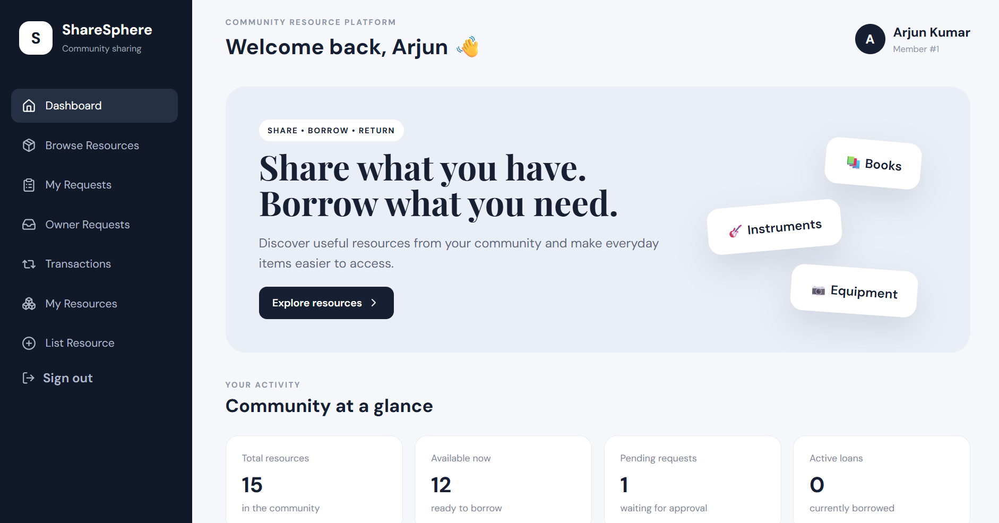
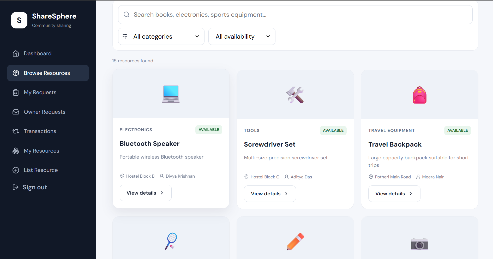
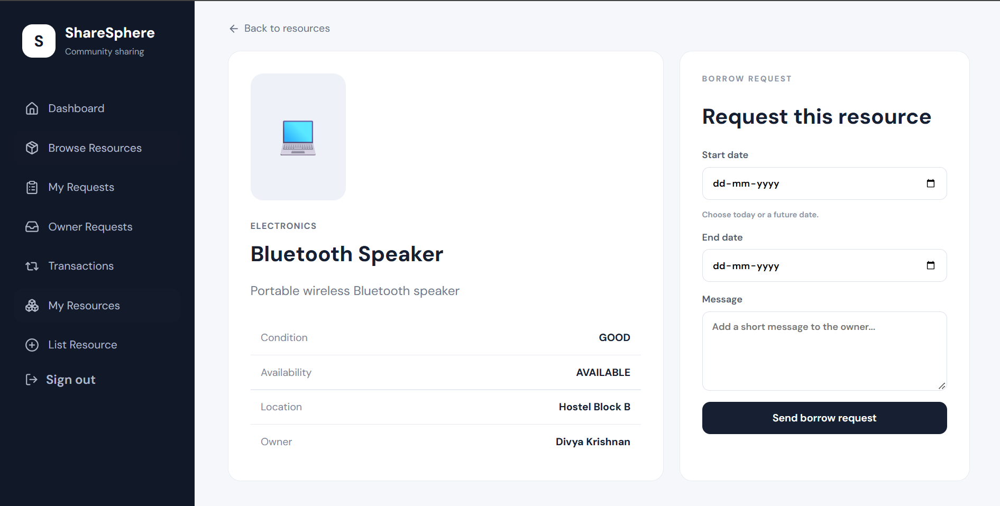
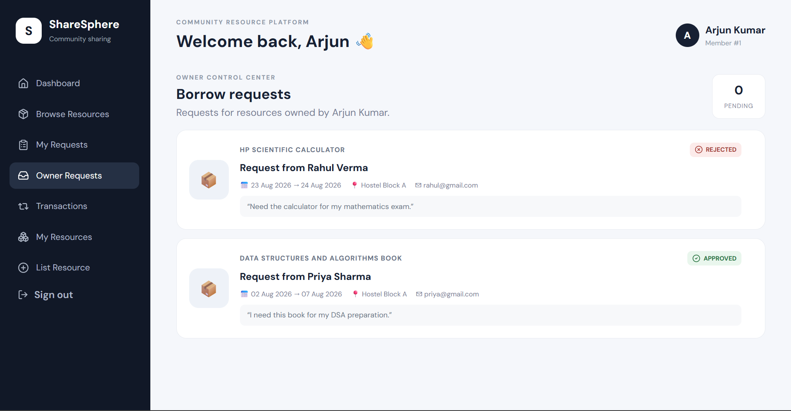
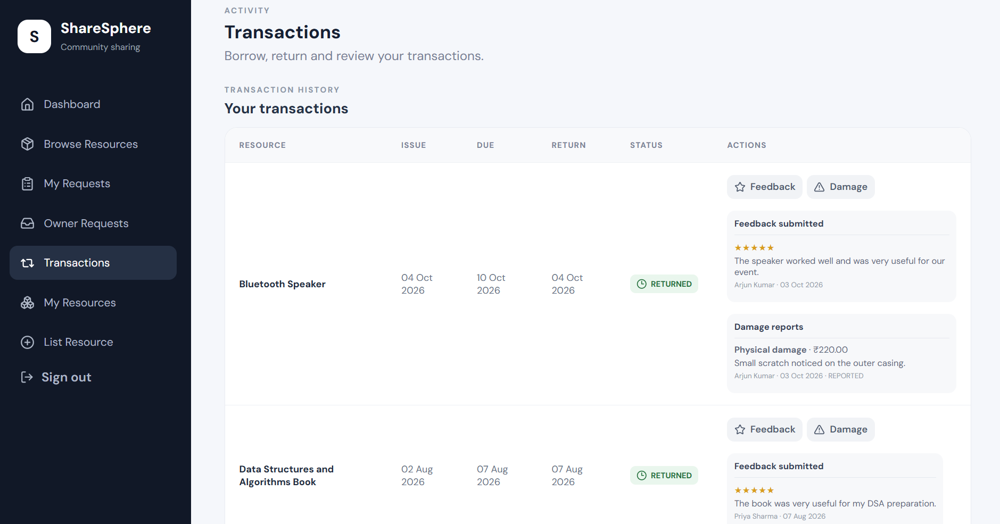

\# ShareSphere


\### Community Resource Sharing Platform


ShareSphere is a full-stack community resource sharing platform designed for college campuses and local communities. Users can list resources they own, browse available resources, request to borrow them, manage approvals, track transactions, return resources, provide feedback, and report damages.


\## 🌐 Live Demo


\*\*Live Application:\*\*  

https://share-sphere-q0op1qzdx-sarayunarra26-9867s-projects.vercel.app


\## ✨ Features


\### User Authentication

\- User registration and login

\- Secure password hashing using Node.js `scrypt`

\- Show password option

\- Automatic migration of existing plaintext passwords to secure hashes


\### Resource Management

\- List resources for sharing

\- Browse available resources

\- Search resources

\- Filter by category and availability

\- View detailed resource information

\- Manage resource availability

\- Mark resources as available or under maintenance


\### Borrowing Workflow

\- Submit borrow requests

\- View personal requests

\- Resource owners can approve or reject requests

\- Create borrowing transactions

\- Track active and returned transactions

\- Validate borrowing and return dates


\### Feedback \& Damage Reporting

\- Submit 1–5 star ratings

\- Add feedback comments

\- Report resource damage

\- Record estimated damage cost

\- Track damage report status


\### Database Features

\- Primary and foreign keys

\- Unique and check constraints

\- Normalized relational schema

\- 3NF database design

\- Indexes

\- Views

\- Stored procedures

\- Triggers

\- Transactions and savepoints


\## 🛠️ Tech Stack


\### Frontend

\- React

\- Vite

\- CSS

\- JavaScript


\### Backend

\- Node.js

\- Express.js

\- REST APIs


\### Database

\- MySQL


\### Deployment

\- Vercel - Frontend

\- Railway - Backend and MySQL


\## 🏗️ System Architecture


```text

&#x20;               ┌─────────────────────┐

&#x20;               │   React + Vite      │

&#x20;               │     Frontend        │

&#x20;               └──────────┬──────────┘

&#x20;                          │

&#x20;                          │ REST API

&#x20;                          ▼

&#x20;               ┌─────────────────────┐

&#x20;               │   Node.js + Express │

&#x20;               │      Backend        │

&#x20;               └──────────┬──────────┘

&#x20;                          │

&#x20;                          │ MySQL

&#x20;                          ▼

&#x20;               ┌─────────────────────┐

&#x20;               │    Railway MySQL    │

&#x20;               │      Database       │

&#x20;               └─────────────────────┘


## 📸 Screenshots

### Dashboard

The dashboard provides an overview of community resources, availability, pending requests, and active loans.



### Browse Resources

Users can search and filter resources by category and availability.



### Resource Details & Borrow Request

Users can view resource details and submit borrowing requests with start dates, end dates, and a message to the owner.



### Owner Requests

Resource owners can review incoming requests and approve or reject them.



### Transactions

Users can track borrowing and return transactions, submit feedback, and report damage.


